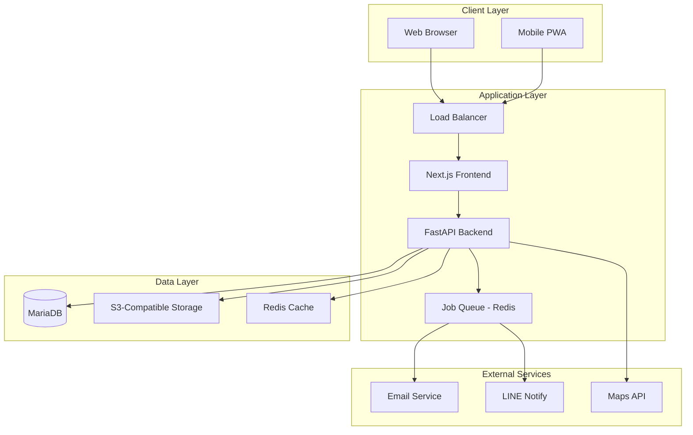
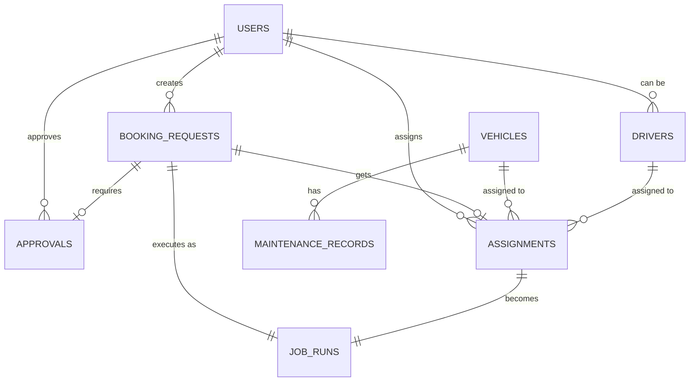

# Design Document - Office Vehicle Booking System

## Overview

ระบบจองรถสำนักงานเป็น web application ที่ออกแบบมาเพื่อรองรับการใช้งานแบบ multi-tenant โดยใช้สถาปัตยกรรม 3-tier architecture ประกอบด้วย Frontend (Next.js), Backend API (FastAPI), และ Database (MariaDB) พร้อมด้วย file storage สำหรับรูปภาพและเอกสาร

ระบบรองรับการใช้งานผ่าน web browser และ mobile device (PWA) โดยเน้นประสบการณ์ผู้ใช้ที่ราบรื่นและการจัดการทรัพยากรที่มีประสิทธิภาพ

## Architecture

### High-Level Architecture



### Technology Stack

**Frontend:**
- Next.js 14 with App Router
- React 18 with TypeScript
- Tailwind CSS for styling
- PWA capabilities for mobile support
- React Query for state management
- React Hook Form for form handling

**Backend:**
- FastAPI with Python 3.11+
- SQLAlchemy ORM with Alembic migrations
- Pydantic for data validation
- JWT authentication with role-based access control
- Celery with Redis for background tasks

**Database:**
- MariaDB 10.11+ with UTF8MB4 charset
- Redis for caching and job queue
- S3-compatible storage (MinIO) for file uploads

**Infrastructure:**
- Docker containers with Docker Compose
- Nginx as reverse proxy and load balancer
- SSL/TLS termination
- Automated backup scripts

## Components and Interfaces

### Frontend Components

#### 1. Authentication Module
- Login/Logout components
- Role-based route protection
- 2FA implementation for admin users
- Session management

#### 2. Dashboard Components
```typescript
interface DashboardProps {
  userRole: 'requester' | 'manager' | 'fleet_admin' | 'driver' | 'auditor';
  notifications: Notification[];
  quickStats: QuickStats;
}

interface QuickStats {
  pendingRequests: number;
  todayJobs: number;
  vehicleUtilization: number;
  upcomingMaintenance: number;
}
```

#### 3. Booking Management
```typescript
interface BookingFormData {
  purpose: string;
  passengerCount: number;
  startDateTime: Date;
  endDateTime: Date;
  fromPlace: string;
  toPlace: string;
  vehiclePreference: VehicleType | 'ANY';
  specialRequirements?: string;
}

interface ConflictCheckResult {
  hasConflicts: boolean;
  conflicts: BookingConflict[];
  availableVehicles: Vehicle[];
  availableDrivers: Driver[];
}
```

#### 4. Calendar Component
```typescript
interface CalendarEvent {
  id: string;
  title: string;
  start: Date;
  end: Date;
  resourceId: string;
  resourceType: 'vehicle' | 'driver';
  status: BookingStatus;
  color: string;
}

interface ResourceCalendarProps {
  resources: (Vehicle | Driver)[];
  events: CalendarEvent[];
  onEventClick: (event: CalendarEvent) => void;
  onSlotSelect: (slotInfo: SlotInfo) => void;
}
```

#### 5. Mobile PWA Components
- Responsive design for mobile devices
- Offline capability with service workers
- Camera integration for photo capture
- GPS location services
- Push notifications

### Backend API Structure

#### 1. Authentication & Authorization
```python
from fastapi import Depends, HTTPException
from fastapi.security import HTTPBearer

class RoleChecker:
    def __init__(self, allowed_roles: List[str]):
        self.allowed_roles = allowed_roles
    
    def __call__(self, current_user: User = Depends(get_current_user)):
        if current_user.role not in self.allowed_roles:
            raise HTTPException(status_code=403, detail="Insufficient permissions")
        return current_user

# Usage
@app.post("/api/vehicles")
async def create_vehicle(
    vehicle_data: VehicleCreate,
    user: User = Depends(RoleChecker(["fleet_admin"]))
):
    pass
```

#### 2. Core API Endpoints

**Vehicle Management:**
```python
@router.get("/vehicles", response_model=List[Vehicle])
@router.post("/vehicles", response_model=Vehicle)
@router.get("/vehicles/{vehicle_id}", response_model=Vehicle)
@router.put("/vehicles/{vehicle_id}", response_model=Vehicle)
@router.delete("/vehicles/{vehicle_id}")
@router.get("/vehicles/{vehicle_id}/maintenance-history")
```

**Booking Management:**
```python
@router.post("/bookings", response_model=BookingRequest)
@router.get("/bookings/conflicts")
@router.get("/bookings/{booking_id}", response_model=BookingRequest)
@router.put("/bookings/{booking_id}")
@router.post("/bookings/{booking_id}/approve")
@router.post("/bookings/{booking_id}/reject")
@router.post("/bookings/{booking_id}/assign")
```

**Job Execution:**
```python
@router.post("/jobs/{job_id}/checkin")
@router.post("/jobs/{job_id}/checkout")
@router.post("/jobs/{job_id}/upload-images")
@router.get("/jobs/driver/{driver_id}/today")
```

#### 3. Background Tasks
```python
from celery import Celery

@celery_app.task
def send_booking_notification(booking_id: int, notification_type: str):
    """Send email/LINE notifications for booking events"""
    pass

@celery_app.task
def check_document_expiry():
    """Daily task to check vehicle document expiry"""
    pass

@celery_app.task
def generate_monthly_report(month: int, year: int):
    """Generate monthly utilization reports"""
    pass
```

## Data Models

### Core Entities

#### 1. User Management
```sql
CREATE TABLE users (
    id INT AUTO_INCREMENT PRIMARY KEY,
    username VARCHAR(50) UNIQUE NOT NULL,
    email VARCHAR(100) UNIQUE NOT NULL,
    full_name VARCHAR(120) NOT NULL,
    department VARCHAR(100),
    role ENUM('requester', 'manager', 'fleet_admin', 'driver', 'auditor') NOT NULL,
    is_active BOOLEAN DEFAULT TRUE,
    two_fa_enabled BOOLEAN DEFAULT FALSE,
    created_at TIMESTAMP DEFAULT CURRENT_TIMESTAMP,
    updated_at TIMESTAMP DEFAULT CURRENT_TIMESTAMP ON UPDATE CURRENT_TIMESTAMP
);
```

#### 2. Vehicle Management
```sql
CREATE TABLE vehicles (
    id INT AUTO_INCREMENT PRIMARY KEY,
    registration_number VARCHAR(20) UNIQUE NOT NULL,
    vehicle_type ENUM('SEDAN', 'VAN', 'PICKUP', 'BUS', 'OTHER') NOT NULL,
    brand VARCHAR(60) NOT NULL,
    model VARCHAR(60) NOT NULL,
    year_manufactured INT,
    seating_capacity INT NOT NULL,
    fuel_type ENUM('GASOLINE', 'DIESEL', 'HYBRID', 'ELECTRIC') DEFAULT 'GASOLINE',
    status ENUM('ACTIVE', 'MAINTENANCE', 'INACTIVE') DEFAULT 'ACTIVE',
    current_mileage INT DEFAULT 0,
    
    -- Document tracking
    tax_expiry_date DATE,
    insurance_expiry_date DATE,
    inspection_expiry_date DATE,
    
    -- Additional info
    notes TEXT,
    created_at TIMESTAMP DEFAULT CURRENT_TIMESTAMP,
    updated_at TIMESTAMP DEFAULT CURRENT_TIMESTAMP ON UPDATE CURRENT_TIMESTAMP,
    
    INDEX idx_status (status),
    INDEX idx_vehicle_type (vehicle_type),
    INDEX idx_registration (registration_number)
);
```

#### 3. Driver Management
```sql
CREATE TABLE drivers (
    id INT AUTO_INCREMENT PRIMARY KEY,
    employee_code VARCHAR(30) UNIQUE NOT NULL,
    user_id INT,
    full_name VARCHAR(120) NOT NULL,
    phone_number VARCHAR(30),
    license_number VARCHAR(60) NOT NULL,
    license_type VARCHAR(20) DEFAULT 'B',
    license_expiry_date DATE NOT NULL,
    status ENUM('ACTIVE', 'INACTIVE', 'ON_LEAVE') DEFAULT 'ACTIVE',
    
    -- Availability settings (JSON format)
    availability_schedule JSON,
    
    created_at TIMESTAMP DEFAULT CURRENT_TIMESTAMP,
    updated_at TIMESTAMP DEFAULT CURRENT_TIMESTAMP ON UPDATE CURRENT_TIMESTAMP,
    
    FOREIGN KEY (user_id) REFERENCES users(id) ON DELETE SET NULL,
    INDEX idx_status (status),
    INDEX idx_license_expiry (license_expiry_date)
);
```

#### 4. Booking System
```sql
CREATE TABLE booking_requests (
    id INT AUTO_INCREMENT PRIMARY KEY,
    requester_id INT NOT NULL,
    department VARCHAR(100),
    purpose VARCHAR(500) NOT NULL,
    passenger_count INT NOT NULL DEFAULT 1,
    
    -- Trip details
    start_datetime DATETIME NOT NULL,
    end_datetime DATETIME NOT NULL,
    pickup_location VARCHAR(500) NOT NULL,
    dropoff_location VARCHAR(500) NOT NULL,
    
    -- Vehicle preference
    vehicle_preference ENUM('ANY', 'SEDAN', 'VAN', 'PICKUP', 'BUS', 'OTHER') DEFAULT 'ANY',
    special_requirements TEXT,
    
    -- Status tracking
    status ENUM('DRAFT', 'REQUESTED', 'APPROVED', 'REJECTED', 'ASSIGNED', 'IN_PROGRESS', 'COMPLETED', 'CANCELLED') DEFAULT 'DRAFT',
    
    -- Timestamps
    submitted_at TIMESTAMP NULL,
    created_at TIMESTAMP DEFAULT CURRENT_TIMESTAMP,
    updated_at TIMESTAMP DEFAULT CURRENT_TIMESTAMP ON UPDATE CURRENT_TIMESTAMP,
    
    FOREIGN KEY (requester_id) REFERENCES users(id),
    INDEX idx_status (status),
    INDEX idx_datetime (start_datetime, end_datetime),
    INDEX idx_requester (requester_id)
);
```

#### 5. Approval Workflow
```sql
CREATE TABLE approvals (
    id INT AUTO_INCREMENT PRIMARY KEY,
    booking_request_id INT NOT NULL,
    approver_id INT NOT NULL,
    approval_level INT DEFAULT 1,
    decision ENUM('APPROVED', 'REJECTED') NOT NULL,
    reason VARCHAR(500),
    decided_at TIMESTAMP DEFAULT CURRENT_TIMESTAMP,
    
    FOREIGN KEY (booking_request_id) REFERENCES booking_requests(id) ON DELETE CASCADE,
    FOREIGN KEY (approver_id) REFERENCES users(id),
    INDEX idx_booking (booking_request_id),
    INDEX idx_approver (approver_id)
);
```

#### 6. Resource Assignment
```sql
CREATE TABLE assignments (
    id INT AUTO_INCREMENT PRIMARY KEY,
    booking_request_id INT UNIQUE NOT NULL,
    vehicle_id INT NOT NULL,
    driver_id INT NOT NULL,
    assigned_by INT NOT NULL,
    assigned_at TIMESTAMP DEFAULT CURRENT_TIMESTAMP,
    notes TEXT,
    
    FOREIGN KEY (booking_request_id) REFERENCES booking_requests(id) ON DELETE CASCADE,
    FOREIGN KEY (vehicle_id) REFERENCES vehicles(id),
    FOREIGN KEY (driver_id) REFERENCES drivers(id),
    FOREIGN KEY (assigned_by) REFERENCES users(id),
    INDEX idx_vehicle (vehicle_id),
    INDEX idx_driver (driver_id)
);
```

#### 7. Job Execution
```sql
CREATE TABLE job_runs (
    id INT AUTO_INCREMENT PRIMARY KEY,
    booking_request_id INT UNIQUE NOT NULL,
    
    -- Check-in data
    checkin_datetime TIMESTAMP NULL,
    checkin_mileage INT NULL,
    checkin_images JSON NULL,
    checkin_location VARCHAR(500) NULL,
    
    -- Check-out data
    checkout_datetime TIMESTAMP NULL,
    checkout_mileage INT NULL,
    checkout_images JSON NULL,
    checkout_location VARCHAR(500) NULL,
    
    -- Expenses
    fuel_cost DECIMAL(10,2) DEFAULT 0.00,
    toll_cost DECIMAL(10,2) DEFAULT 0.00,
    other_expenses DECIMAL(10,2) DEFAULT 0.00,
    expense_receipts JSON NULL,
    
    -- Incident reporting
    incident_report TEXT NULL,
    incident_images JSON NULL,
    
    -- Status
    status ENUM('SCHEDULED', 'IN_PROGRESS', 'COMPLETED', 'CANCELLED') DEFAULT 'SCHEDULED',
    
    created_at TIMESTAMP DEFAULT CURRENT_TIMESTAMP,
    updated_at TIMESTAMP DEFAULT CURRENT_TIMESTAMP ON UPDATE CURRENT_TIMESTAMP,
    
    FOREIGN KEY (booking_request_id) REFERENCES booking_requests(id) ON DELETE CASCADE,
    INDEX idx_status (status),
    INDEX idx_checkin_date (checkin_datetime)
);
```

### Relationship Mapping



## Error Handling

### API Error Response Format
```typescript
interface APIError {
  error: {
    code: string;
    message: string;
    details?: any;
    timestamp: string;
    requestId: string;
  };
}
```

### Error Categories

#### 1. Validation Errors (400)
```python
class ValidationError(HTTPException):
    def __init__(self, field: str, message: str):
        super().__init__(
            status_code=400,
            detail={
                "code": "VALIDATION_ERROR",
                "message": f"Validation failed for field '{field}': {message}",
                "field": field
            }
        )
```

#### 2. Business Logic Errors (422)
```python
class ConflictError(HTTPException):
    def __init__(self, message: str, conflicts: List[dict] = None):
        super().__init__(
            status_code=422,
            detail={
                "code": "BOOKING_CONFLICT",
                "message": message,
                "conflicts": conflicts or []
            }
        )
```

#### 3. Authorization Errors (403)
```python
class InsufficientPermissionError(HTTPException):
    def __init__(self, required_role: str):
        super().__init__(
            status_code=403,
            detail={
                "code": "INSUFFICIENT_PERMISSION",
                "message": f"This action requires {required_role} role"
            }
        )
```

### Frontend Error Handling
```typescript
class ErrorHandler {
  static handle(error: APIError): void {
    switch (error.error.code) {
      case 'BOOKING_CONFLICT':
        toast.error('มีการจองที่ชนกัน กรุณาเลือกเวลาอื่น');
        break;
      case 'VALIDATION_ERROR':
        toast.error(`ข้อมูลไม่ถูกต้อง: ${error.error.message}`);
        break;
      case 'INSUFFICIENT_PERMISSION':
        toast.error('คุณไม่มีสิทธิ์ในการดำเนินการนี้');
        break;
      default:
        toast.error('เกิดข้อผิดพลาด กรุณาลองใหม่อีกครั้ง');
    }
  }
}
```

## Testing Strategy

### 1. Unit Testing

**Backend (pytest):**
```python
# Test conflict detection
def test_booking_conflict_detection():
    # Create overlapping bookings
    booking1 = create_booking(start="2024-01-15 09:00", end="2024-01-15 17:00")
    booking2 = create_booking(start="2024-01-15 14:00", end="2024-01-15 18:00")
    
    conflicts = check_conflicts(booking2)
    assert len(conflicts) == 1
    assert conflicts[0].id == booking1.id

# Test approval workflow
def test_approval_workflow():
    booking = create_booking_request()
    approval = approve_booking(booking.id, manager_id=1)
    
    assert booking.status == BookingStatus.APPROVED
    assert approval.decision == ApprovalDecision.APPROVED
```

**Frontend (Jest + React Testing Library):**
```typescript
// Test booking form validation
test('should show validation errors for invalid dates', () => {
  render(<BookingForm />);
  
  const startDate = screen.getByLabelText('วันที่เริ่มต้น');
  const endDate = screen.getByLabelText('วันที่สิ้นสุด');
  
  fireEvent.change(startDate, { target: { value: '2024-01-15' } });
  fireEvent.change(endDate, { target: { value: '2024-01-14' } });
  
  expect(screen.getByText('วันที่สิ้นสุดต้องมากกว่าวันที่เริ่มต้น')).toBeInTheDocument();
});
```

### 2. Integration Testing

**API Integration:**
```python
def test_booking_workflow_integration():
    # Create booking request
    response = client.post("/api/bookings", json=booking_data)
    booking_id = response.json()["id"]
    
    # Approve booking
    client.post(f"/api/bookings/{booking_id}/approve", 
                json={"decision": "APPROVED"})
    
    # Assign vehicle and driver
    client.post(f"/api/bookings/{booking_id}/assign",
                json={"vehicle_id": 1, "driver_id": 1})
    
    # Verify final state
    booking = client.get(f"/api/bookings/{booking_id}").json()
    assert booking["status"] == "ASSIGNED"
```

### 3. End-to-End Testing (Playwright)

```typescript
test('complete booking workflow', async ({ page }) => {
  // Login as requester
  await page.goto('/login');
  await page.fill('[data-testid=username]', 'requester@company.com');
  await page.fill('[data-testid=password]', 'password');
  await page.click('[data-testid=login-button]');
  
  // Create booking request
  await page.click('[data-testid=new-booking-button]');
  await page.fill('[data-testid=purpose]', 'ประชุมลูกค้า');
  await page.fill('[data-testid=start-date]', '2024-01-15');
  await page.fill('[data-testid=start-time]', '09:00');
  await page.fill('[data-testid=end-date]', '2024-01-15');
  await page.fill('[data-testid=end-time]', '17:00');
  await page.click('[data-testid=submit-button]');
  
  // Verify booking created
  await expect(page.locator('[data-testid=success-message]')).toBeVisible();
});
```

### 4. Performance Testing

**Load Testing (Locust):**
```python
from locust import HttpUser, task, between

class BookingUser(HttpUser):
    wait_time = between(1, 3)
    
    def on_start(self):
        # Login
        response = self.client.post("/api/auth/login", json={
            "username": "test@company.com",
            "password": "password"
        })
        self.token = response.json()["access_token"]
        self.client.headers.update({"Authorization": f"Bearer {self.token}"})
    
    @task(3)
    def view_calendar(self):
        self.client.get("/api/calendar?start=2024-01-01&end=2024-01-31")
    
    @task(1)
    def create_booking(self):
        self.client.post("/api/bookings", json={
            "purpose": "Test booking",
            "start_datetime": "2024-01-15T09:00:00",
            "end_datetime": "2024-01-15T17:00:00",
            "pickup_location": "Office",
            "dropoff_location": "Client site"
        })
```

## Security Considerations

### 1. Authentication & Authorization
- JWT tokens with short expiration (15 minutes) and refresh tokens
- Role-based access control (RBAC) with principle of least privilege
- 2FA mandatory for admin and fleet admin roles
- Password policy enforcement (minimum 8 characters, complexity requirements)

### 2. Data Protection
- Encryption at rest using AES-256
- TLS 1.3 for data in transit
- Sensitive data (license numbers, phone numbers) encrypted in database
- PII data retention policies and automated cleanup

### 3. API Security
```python
from fastapi import Security
from fastapi.security import HTTPBearer
import jwt

security = HTTPBearer()

async def verify_token(token: str = Security(security)):
    try:
        payload = jwt.decode(token, SECRET_KEY, algorithms=["HS256"])
        return payload
    except jwt.ExpiredSignatureError:
        raise HTTPException(status_code=401, detail="Token expired")
    except jwt.InvalidTokenError:
        raise HTTPException(status_code=401, detail="Invalid token")
```

### 4. File Upload Security
```python
ALLOWED_EXTENSIONS = {'.jpg', '.jpeg', '.png', '.pdf'}
MAX_FILE_SIZE = 10 * 1024 * 1024  # 10MB

async def validate_file(file: UploadFile):
    # Check file extension
    if not any(file.filename.lower().endswith(ext) for ext in ALLOWED_EXTENSIONS):
        raise HTTPException(400, "File type not allowed")
    
    # Check file size
    content = await file.read()
    if len(content) > MAX_FILE_SIZE:
        raise HTTPException(400, "File too large")
    
    # Reset file pointer
    await file.seek(0)
    return file
```

### 5. Audit Logging
```python
async def log_audit_event(
    user_id: int,
    action: str,
    entity_type: str,
    entity_id: int,
    before_data: dict = None,
    after_data: dict = None
):
    audit_log = AuditLog(
        user_id=user_id,
        action=action,
        entity_type=entity_type,
        entity_id=entity_id,
        before_data=before_data,
        after_data=after_data,
        ip_address=request.client.host,
        user_agent=request.headers.get("user-agent"),
        timestamp=datetime.utcnow()
    )
    db.add(audit_log)
    await db.commit()
```

## Performance Optimization

### 1. Database Optimization
- Proper indexing on frequently queried columns
- Query optimization with EXPLAIN analysis
- Connection pooling (max 20 connections)
- Read replicas for reporting queries

### 2. Caching Strategy
```python
from redis import Redis
import json

redis_client = Redis(host='redis', port=6379, db=0)

async def get_available_vehicles(start_date: datetime, end_date: datetime):
    cache_key = f"available_vehicles:{start_date.isoformat()}:{end_date.isoformat()}"
    
    # Try cache first
    cached_result = redis_client.get(cache_key)
    if cached_result:
        return json.loads(cached_result)
    
    # Query database
    vehicles = await query_available_vehicles(start_date, end_date)
    
    # Cache for 5 minutes
    redis_client.setex(cache_key, 300, json.dumps(vehicles))
    return vehicles
```

### 3. Frontend Optimization
- Code splitting with Next.js dynamic imports
- Image optimization with Next.js Image component
- Service worker for offline functionality
- React Query for efficient data fetching and caching

### 4. API Rate Limiting
```python
from slowapi import Limiter, _rate_limit_exceeded_handler
from slowapi.util import get_remote_address

limiter = Limiter(key_func=get_remote_address)

@app.post("/api/bookings")
@limiter.limit("10/minute")
async def create_booking(request: Request, booking_data: BookingCreate):
    # Booking creation logic
    pass
```

## Deployment Architecture

### Docker Compose Setup
```yaml
version: '3.8'

services:
  frontend:
    build: ./frontend
    ports:
      - "3000:3000"
    environment:
      - NEXT_PUBLIC_API_URL=http://backend:8000
    depends_on:
      - backend

  backend:
    build: ./backend
    ports:
      - "8000:8000"
    environment:
      - DATABASE_URL=mysql://user:password@db:3306/vehicle_booking
      - REDIS_URL=redis://redis:6379
    depends_on:
      - db
      - redis

  db:
    image: mariadb:10.11
    environment:
      - MYSQL_ROOT_PASSWORD=rootpassword
      - MYSQL_DATABASE=vehicle_booking
      - MYSQL_USER=user
      - MYSQL_PASSWORD=password
    volumes:
      - db_data:/var/lib/mysql
      - ./init.sql:/docker-entrypoint-initdb.d/init.sql

  redis:
    image: redis:7-alpine
    ports:
      - "6379:6379"

  nginx:
    image: nginx:alpine
    ports:
      - "80:80"
      - "443:443"
    volumes:
      - ./nginx.conf:/etc/nginx/nginx.conf
      - ./ssl:/etc/nginx/ssl
    depends_on:
      - frontend
      - backend

volumes:
  db_data:
```

### Monitoring and Logging
- Application logs with structured JSON format
- Health check endpoints for all services
- Prometheus metrics collection
- Grafana dashboards for system monitoring
- Alert manager for critical issues

This design provides a robust, scalable, and maintainable solution for the office vehicle booking system while addressing all the requirements specified in the requirements document.